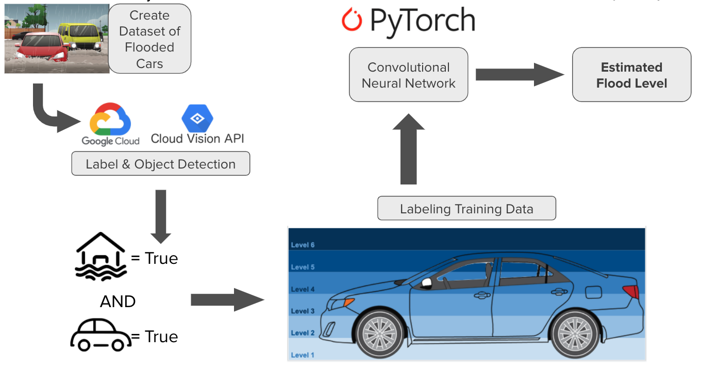
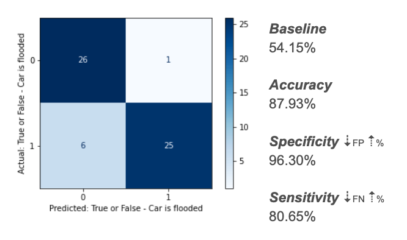
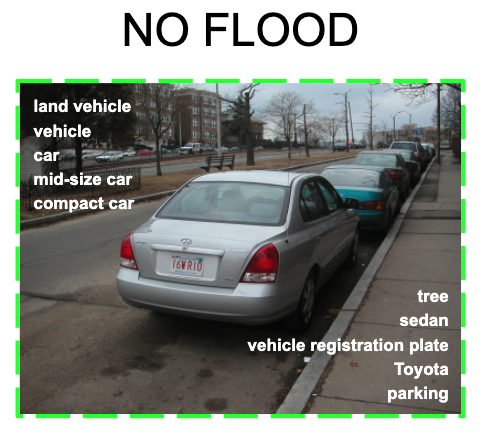
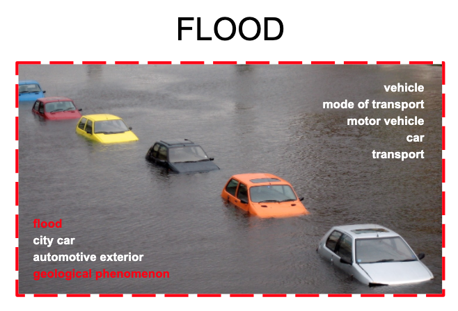
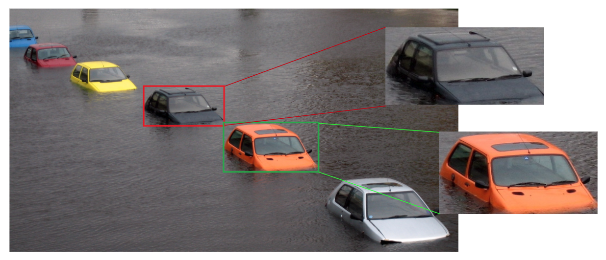
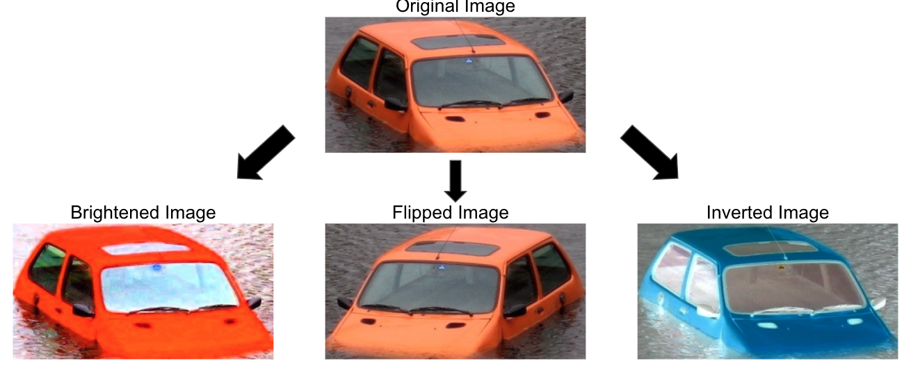
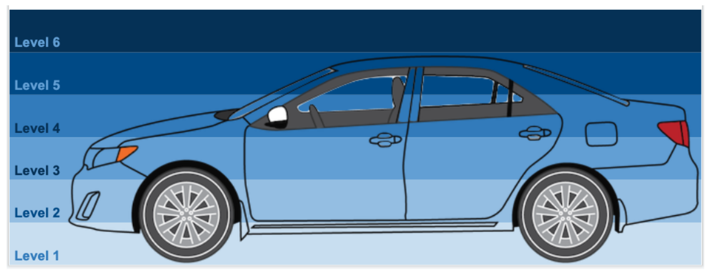
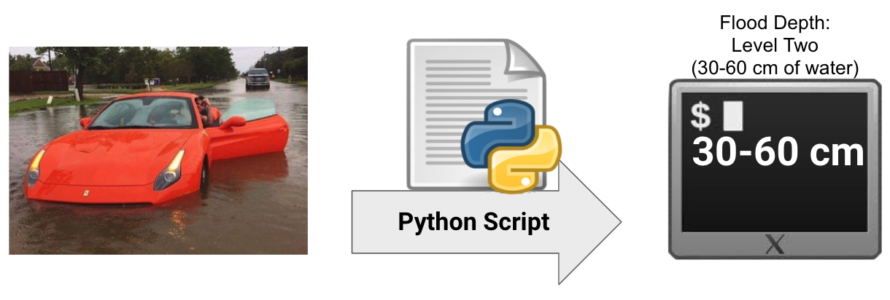

# Project 5: Estimating Flood Depths of Submerged Vehicles with Convolutional Neural Networks (cNN)

### By Data Scientists Nikhil Lonberg, Tony Lucci, Erik Lindberg, Lydia Kajeckas, and James Pecore

## PROJECT MAP
 - [README.md](./README.md)
 - [code](./code)
  - [Google Vision](./code/google_vision.ipynb)
  - [Annotation Processing](./code/get_annotations.ipynb)
  - [Bootstrapping](./code/bootsrapping.ipynb)
  - [Model](./code/ResNet50.pth)
  - [Python Script](./code/flood_script)
   - [Main](./code/flood_script/main.py)
   - [Object Detection](./code/flood_script/02-modeling.py)
   - [Flood Prediction](./code/flood_script/detect_objects.py)
 - [Presentation Deck](./presentation.pdf)
 - [Images](./project-5-images)
  - [Overview](./project-5-images/image-1.png)
  - [Label Detector Confusion Matrix](./project-5-images/image-2.png)
  - [No Flood Labels](./project-5-images/image-3.png)
  - [Flood Labels](./project-5-images/image-4.png)
  - [Object Detection](./project-5-images/image-5.png)
  - [Bootstrapping Process](./project-5-images/image-6.png)
  - [Flood Level Heights](./project-5-images/image-7.png)
  - [Python Script Process](./project-5-images/image-8.png)

## Problem Statement

Both a car insurance company and a motor-vehicle owner have a vested commercial interest in being able to estimate a car's damages caused by natural disasters, floods in particular. The United States 2020 Census recognizes floods as the most common natural disaster in the country, and cars are particularly vulnerable to flood damages due to their internal technologies. The 2019 Mississippi River Floods resulted in 20 Billion Dollars of damages alone. 

As a result of these factors, we need to be able to use Visual APIs, Machine Learning, and Neural Networks to systematically label the depths of flooded motor vehicles. Which APIs and forms of Machine Learning will we use to recognize our target variable "flood depth?" More importantly, how accurately can we estimate flood depth, considering the baseline flood depth predictions are only 20% accurate for this type of model.

## Executive Summary
- After extensive research, we decided to use the Google Vision API to specifically identify flooded from non-flooded cars. 
- We created a dataset of flooded and non-flooded cars from public domain image sources. 
- Next, we used Google Vision’s API to label specific objects like “wheel,” “window,” etc. in our dataset.
- Then, we trained the Google Vision API to recognize flooded cars as different objects from non-flooded cars.
- To enlarge our dataset, we used Image Augmentation to visually bootstrap our images. 
- We assigned Flood Height to these images.
- Finally, we inputted our processed flooded vehicles through our Convolutional Neural Network, successfully estimating flood height with visual images.



## Contents:

### Dataset Creation
- Humans have the ability to detect “object continuity.” This lets us differentiate a flooded car as a different object than the water surrounding it. We want to train a computer to also be able to recognize “object continuity.""

### Label Detection
- 87.93% of images are accurately differentiated between between floods and non-floods with 96.30% specificity (degree of false negatives) and 80.65% sensitivity (degree of false positives).


- Label detection lets us teach the computer how to differentiate between non-flooded and flooded images by differentiating between non-continuous objects and labeling them as different (e.g. a car is different from the tree behind it).



### Object Detection
- Google Vision API detects and labels objects, bounding those objects with boxes
- We created a function to crop and grab images that contain vehicles specifically


### Image Augmentation (Visual Bootstrapping)
- To increase image sample size for the model, each cropped vehicle had three additional images created (one brightened image, one flipped image, and one inverted image)
- We did not create flipped images facing upside down, because that would impede our ability to estimate flood depth


### Assigning Flood Height to Images
- We assign to the training dataset various levels of height to a given car in centimeters, allowing us to measure the depth of flood by level


### Modeling Flood Depth with a Neural Network
- Based on the neuronal interconnections of synapses in the human brain, our convolutional Neural Network uses the training data to estimate flood depth to up to 60% accuracy
- Considering that the baseline value for this neural network is 20%, our increasing its accuracy by 40% is an incredible achievement! (especially considered we only worked upon this project for two weeks, while many have gotten their Ph.D's studying this specific subject)

## Uses of Flood Depth Analysis
1. Insurance Companies
- Verifying insurance claims for flooded cars
- Estimating damages more quickly and with objective fairness

2. Citizen Flood Alerting
- An app could be created to upload images of flooded cars to the local authorities
- Allowing citizens to notify the news/authorities where flooding occurs

3. Climate Change Monitoring
- Allowing climate scientists to compare flood depths with previous years

## Project Conclusions
- Using the Google Vision API, we can train a computer to detect cars as flooded versus not-flooded almost 90% of the time!
- We can use object and label detection to differentiate cars from their surrounding floods.
- Using Image Augmentation, we can generate a much larger dataset from a relatively small database of flooded car images.
- We can use a Convolutional Neural Network to estimate flood depth accurately 64% of the time
- The baseline flood accuracy is only 20%! This means we’ve made a huge improvement on this model! Again, for a problem that has produced multiple Ph.D theses in Comp. Sci, these results are great!
- Our product of Python Script can accurately predict flood depth level to within 30cm a total of 64% of the time. Moreover, with more development, we can improve this accuracy much further. 



## Python Script Instructions
- In order to use the flood-depth script, you must be a member of the Google Cloud Platform.
- To run the script, navigate to the directory "flood_script" in your console
- Run the following:
```python3 main.py [arg0] [arg1] [argn]```
- ```[arg0]``` is a file path to your Google Cloud API Keys.
- ```[arg1]``` is a file path to the image you want to identify flood depth in.
- ```[argn]``` (optional) you can provide any number of additional file paths to images you want to calculate flood depths for.

## Further Research
1. Creating an app for estimating flood depths directly
2. Collect geotag data from images to utilize with google maps to provide which river has flooded and the height over its bank
3. Develop a better neural net / flood detector for predicting floods far OVER 90% of the time

# Data Sources
- Agarwal, Vardan. “Complete Image Augmentation in OpenCV.” Medium, Towards Data Science, 16 May 2020, towardsdatascience.com/complete-image-augmentation-in-opencv-31a6b02694f5. 

- Himanshu Tiwari, et al. “Cropping Concave Polygon from Image Using Opencv Python.” Stack Overflow, 17 May 2018, stackoverflow.com/questions/48301186/cropping-concave-polygon-from-image-using-opencv-python. 

- Kalkowski, S.,  Schulze, C., Dengel, A., & Borth, D. Real-time Analysis and Visualization of the YFCC100m Dataset.  ACM Multimeda Community-Organized Multimodal Mining: Opportunities for Novel Solutions (MMCOMMONS) Workshop, 2015. http://projects.dfki.uni-kl.de/yfcc100m/about#paper

- Life2CodingTechnology. “Cropping Polygon or Non Rectangular Region from Image Using OpenCV Python.” Life2Coding, 28 Aug. 2020, www.life2coding.com/cropping-polygon-or-non-rectangular-region-from-image-using-opencv-python/. 

- US Census Bureau. “Floods.” The United States Census Bureau, 9 July 2019, www.census.gov/topics/preparedness/events/floods.html. 

- US Census Bureau. “OnTheMap for Emergency Management.” OnTheMap, onthemap.ces.census.gov/em/. 
